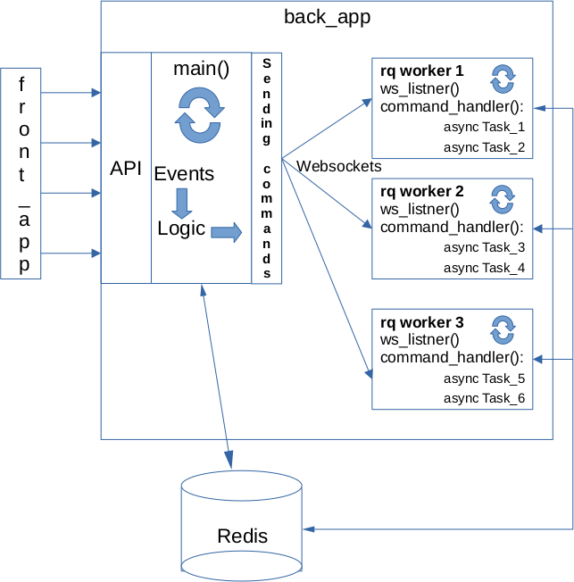

# RMQ-TestStand

RMQ-TestStand is web-application for testing NSYS mobile checking tools that are used in the diagnostic process in the robot Reeva and the robot AGB. Using RMQ-TestStand you can send commands to mobile to test them's running through looking result mesagges on the  PC screen.

## Local getting started

For local running you need to make repository's clone on your local file system. You can make the clone by executing next command:

`https://gitlab.nsysgroup.com/ML/AutoDiagnostic/rmq-teststand.git`

Go to the `develop` branch. After that in the root of cloned repository you need to run in terminal two commands consistently:

`docker compose build`

`docker compose up`

Make sure that docker tools exist in your system. Docker Compose version v2.6.0 and Docker version 24.0.7, build 24.0.7-0ubuntu2~22.04.1 are used at the moment of writing this document.

After running docker containers RMQ-TestStand will accessed on http://0.0.0.0:8501/

Besides on http://0.0.0.0:8001/api/v1/openapi you can find the open api spec of the back_app's service of RMQ-TestStand.

## The application's architechture

The application has microservices architechture and includes three services:

- back_app;

- front_app;

- Redis.

Each services runs in the separated docker container. There is architechture's schema in the Figure 1.

Figure 1

The front_app is responsible for drawing of user interface on the client side. 
The back_app is responsible for receiving front's requests and for sending the signals to run of waiting tasks.
Redis is the common database. It is responsible for storing states of other services and for exchenging some data between them. 

How you can see in the picture, structure of back_app is microservices too. The application's tasks inside back_app run in the separated threads. These threads run in application's booting period and stay in working stage all time of application work. Useful payload is waiting tasks and executes after receiving a signal from main sended from front_app by API. Advantages of such architechture are

- full isolated input and output functions;

- it is easier to use for organizing full isolated waiting real time workers than framworks with the same function;

- an apportunity to use event-driven approach, EDA;

- a great way not to use monolith principle for software developing;

- a good method to formalise the process of code writing.

## The author

Pavel Popov

p.popov@nsysgroup.com

@popov_p_p
